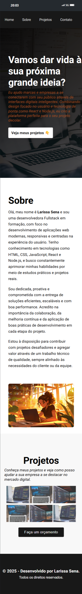

# Portfólio Pessoal - Larissa Sena

Primeiro projeto do curso FullStack Pro - Sujeito programador

> **Status do Projeto:** Em desenvolvimento 🚧

## 📜 Descrição

Este é o repositório do meu portfólio pessoal, uma página única (Single Page Application) desenvolvida para apresentar minhas habilidades. O design é moderno, responsivo e focado na experiência do usuário.

## 🚀 Funcionalidades

- **Página Única (SPA):** Navegação fluida entre as seções sem a necessidade de recarregar a página.
- **Design Responsivo:** Experiência de visualização otimizada para desktops, tablets e smartphones.
- **Menu de Navegação Fixo:** Acesso rápido e fácil a todas as seções a partir de qualquer ponto da página.
- **Seções Dedicadas:**
  - **Home:** Uma chamada de ação impactante para dar as boas-vindas.
  - **Sobre:** Apresentação das minhas qualificações, paixões e competências.
  - **Projetos:** Galeria visual para demonstrar meus trabalhos práticos.
  - **Contato:** Informações para facilitar o contato profissional (a ser implementado).

## 🛠️ Tecnologias Utilizadas

As seguintes tecnologias foram utilizadas na construção deste projeto:

- **HTML5:** Para a estruturação semântica do conteúdo.
- **CSS3:** Para estilização, layouts com Flexbox e responsividade.

## 📄 Licença

Este projeto está sob a licença MIT. Veja o arquivo [LICENSE](LICENSE) para mais detalhes.
